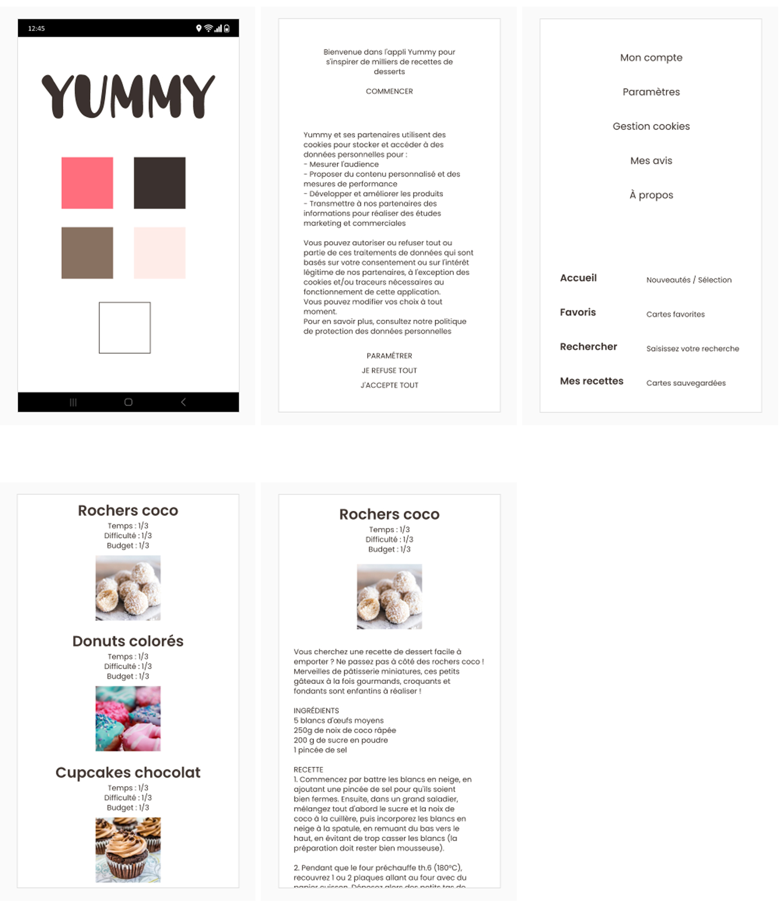
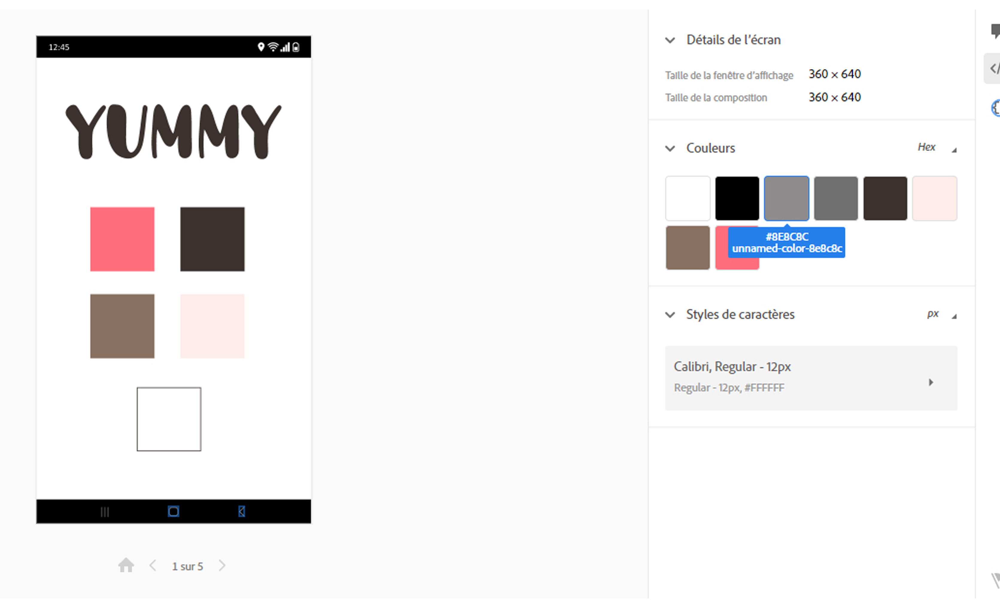
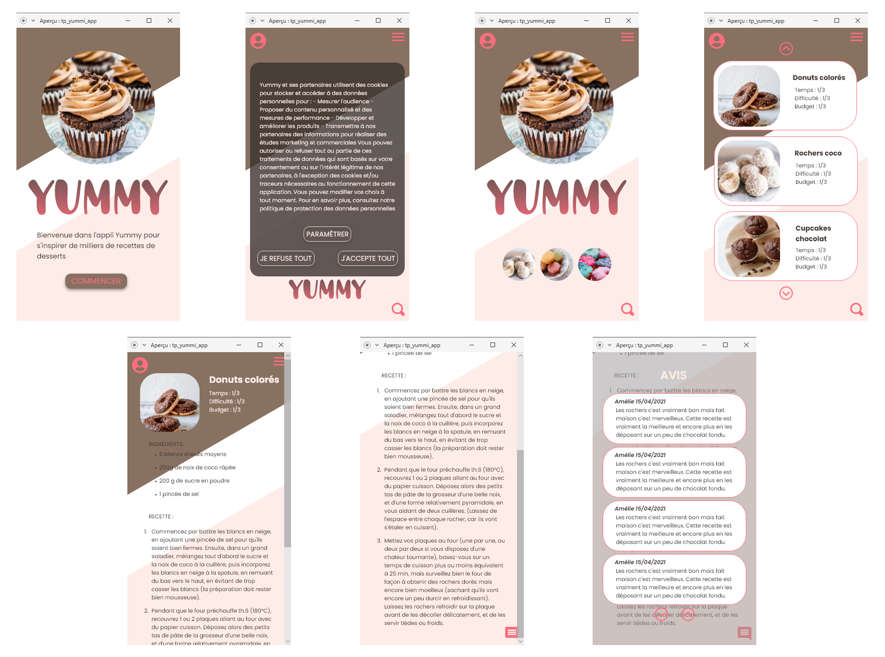
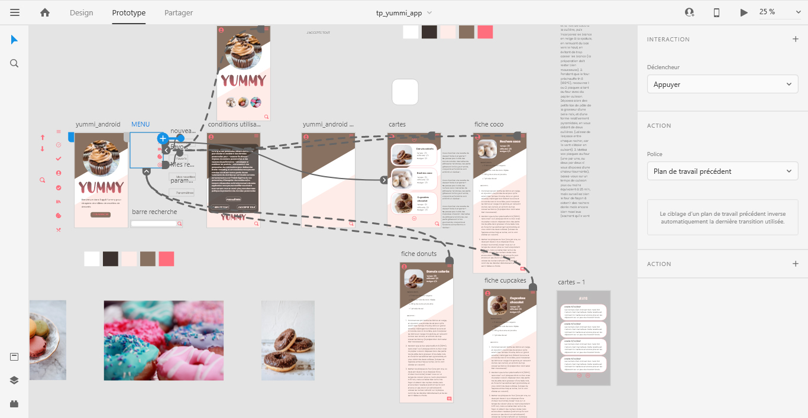
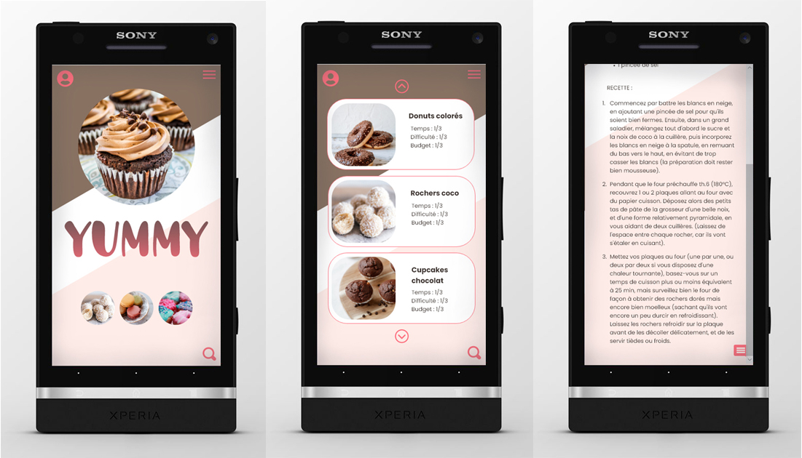

# Tp Maquette d'une application mobile culinaire

## La maquette de l'application demandée :
* Elle comprend 5 pages
  - Page d'accueil
  - Page de cookies
  - Connexion à son compte
  - Bibliothèque de recettes
  - Avis des utilisateurs 
 
* Cahier des charges
  
    
    

## La maquette de l'application créée :
* Création de la maquette suivant le cahier des charges :
  

* Prototypage :

* Mockup :

